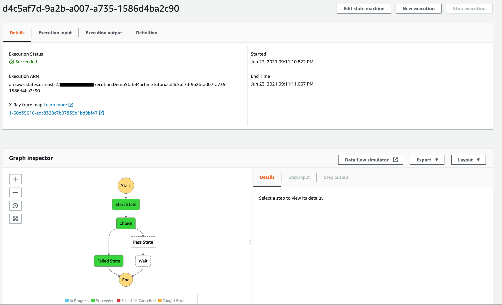

## AWS Step Function

**Introduction**

1. What is Step Function?
    - AWS Step Function is a serverless orchestration service that allows integrating multiple AWS services to collate & design an enterprise-critical application or workflow with advance conditional branching and error handling
    
    - Step Functions provides sequencing, error handling, retry logic, state, and offers a visualization-driven method to organize and represent the series of event-driven steps of your application through its graphical console.

    - And makes it easier and simpler to build and execute multiple-state event-driven critical applications. Step Functions can be invoked automatically via events or via APIGateway and simplifies tracking each step, and retries in case of errors, so the application executes in a defined sequence.

2. What is Amazon State Language (ASL)?

    - ASL is a JSON-based, structured language leveraged to design the state machine, a collection of states, that can do work (Task states), determine which states to transition to next (Choice states), stop execution with an error (Fail states), and so on.
    
    - ASL consist of three things 
      
      - State Machine Structure
      
      - Intrinsic functions
      
      - Common State Fields 
    
    - State Machine Structure: State machines are declared using JSON text and represents a structure consists of the following fields
      
      - Comment: description of state machine
      
      - StartAt: specify the state name from where the state machine to start the execution, and it is case sensitive 
      
      - TimeoutSeconds: maximum time in seconds a state machine can execute
      
      - Version: specify the version of ASL (default 1.0)
      
      - States: a comma-delimited set of states
      
        **Note**: From the above fields Comment, TimeoutSeconds, Version are optional fields
    
    - Intrinsic functions: Intrinsics are constructs like in programming languages, and can be leveraged to manipulate the data going to and from Task Resources
      
      - States.Format: string construction from literal and interpolated values, and takes one or more arguments
      
      - States.StringToJson: input is a single argument, a reference path to an escaped JSON string 
      
      - States.JsonToString: input is a single argument, a reference path, and the interpreter returns a string which is a JSON text
      
      - States.Array: input is a zero or more argument, and the interpreter returns a JSON array containing the Values of the arguments, in the order provided
          
    - Common State Fields
      
      - Type: state's type
      
      - Next: name of the next state that is run when the current state finishes
      
      - End: name of the state that is run at the end
      
      - Comment: human-readable description of the state
      
      - InputPath: state's input to be passed to the state's task for processing
      
      - OutputPath: state's input to be passed to the state's output 
      
        **Note**: From the above fields Comment, InputPath, OutputPath are optional fields

3. What is Workflow Studio?

    - Workflow Studio for AWS Step Functions is a visual workflow designer to create serverless workflows by orchestrating AWS services. 
    
    - With easy drag and drop capability you can design, edit, control how input and output is filtered or transformed for each state and configure error handling. It not helps to create a workflow but also validates the ASL and auto-generates code. 
    
    - Retrieved code can be reviewed, extracted for local development or AWS CloudFormation. Once finished, we can save the workflow, run it, and observe the outcome

4. Build a workflow using Workflow Studio

    - In this tutorial, we learn how to work with Workflow Studio for designing the Step Functions.
    
    - This tutorial will be broken into three phases
    
        - Creating a state machine

        - Start a new execution
     
     - Step 1:  Creating a state machine
     
         A state machine is a visual representation of the workflow. We will leverage Workflow Studio to design, configure and examine each step of the workflow.
        
         1. Traverse to the <a href="https://console.aws.amazon.com/states/">AWS Step Functions</a> and Click on the Get Started option on the right

              
         
         2. Next we will select the authoring method, for this tutorial select Design your workflow visually and type as Standard. Post that click Next
            
             
         
            **Note**: To understand the difference between Standard and Express under Type section expand Help me decide option  
           
         3. Now, we will in the workflow designer studio 
         
            i. Click on the Flow panel from the left pane, search for a Pass state, drag it to the empty state and label it as Start state
            
                
               
                
            
            ii. Search for a Choice state, drag and place it below the Start state, name it as Hello Step Function
            
                
               
            iii. Search for a Pass state again, drag and place it under one branch of the Choice state, name it as Pass state
               
                
            
             iv. Similarly place one more pass state as a Fail state to the other branch of the Choice state.
                
             v. Now we will add rules in the Choice state to leverage the boolean variable $.Validate. If $.Validate is False, then the flow will be pointed towards the Fail state or it will continue its normal execution flow.
             
                
               
               
                

             vi. Configure the default for the Choice state to be Yes, and the cause to be Not Hello World for the No Fail state.
              
                
               
             vi. Search for a Wait state, drag and place it below the Pass state, name it as Wait State, set the wait time to 5 sec.
            
                

            viii. This will complete the workflow and it looks as below, post that click Next
            
                 
               
              ix. Now we will on the review section, under Definition section, review the visual design as well as the ASL code which is auto-generated. Once the review is completed, click Next at the button
              
                 

               x. Now we will provide below details which are required to deploy the state machine  
               
               - Name: name for the state machine
               
               - Permissions: IAM role to execute the state machine
               
               - Logging: enable logging level like All, Error, Fatal, and Off
               
               - Tracing: enable Xray tracing
               
               - Tags: define tags to the state machine
               
               
                
               
               
               xi. Choose to Create state machine 
               
               
     
     - Step 2:  Start a new execution
     
         State machine executions are instances where we run the workflow to perform tasks.
        
         1. To start the execution, select Start execution from the job detail console
         
         2. Next we will provide the input i.e name and Input. Post that click Start execution
            
             
         
            **Note**: name and Input both are optional.
          
         3. Once the execution is started we can verify the output as shown below

            - Output when Validate flag is True
            
               
              
               
            
            - Output when Validate flag is False
            
               
              
                 
     
